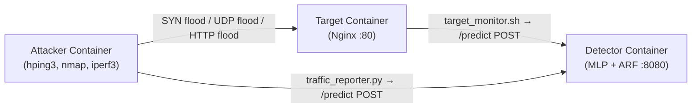
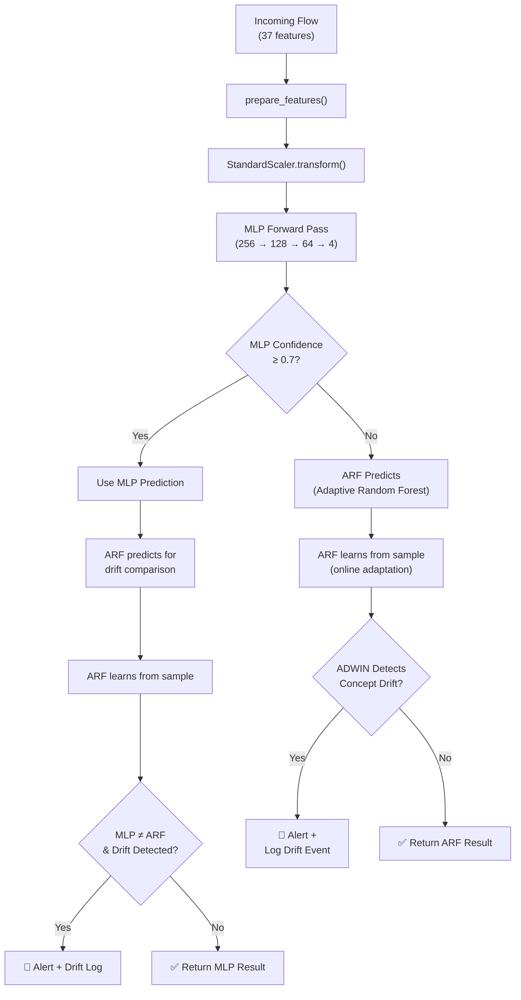

# NIDS — Network Intrusion Detection System

Real-time ML-powered defense against DDoS attacks. Deploys via Docker, detects known and novel threats without retraining.

## Architecture



### Detection Flow



The system uses a **two-model hybrid**: an MLP neural network handles high-confidence predictions on known attacks; an Adaptive Random Forest (ARF) with ADWIN drift detection catches novel threats the MLP hasn't seen before. ARF continuously learns online — no scheduled retraining needed.

## Quick Start

### Prerequisites

- Python 3.9+, Docker & Docker Compose
- [CICDDoS2019](https://cicresearch.ca//CICDDoS2019/) CSV files in `data/raw/`

### 1. Train

```bash
python3 src/run_pipeline.py 1500000
```

Trains the MLP classifier — merges CSVs, selects 37 features from 80, scales, and runs a 256→128→64→4 neural network.

### 2. Launch

```bash
# Standalone (testing)
python3 src/detection/realtime_detector.py

# Full Docker stack (detector + nginx target + attacker)
docker compose -f docker/docker-compose.yml up --build
```

### 3. Classify a flow

```bash
curl -X POST http://localhost:8080/predict \
  -H "Content-Type: application/json" \
  -d '{"Source Port": 60496, "Destination Port": 80, "Protocol": 6, ...}'
```

Response:
```json
{
  "prediction": "Syn",
  "confidence": 0.99,
  "model_used": "mlp",
  "drift_detected": false,
  "is_alert": false
}
```

## API

| Endpoint | Method | Description |
|----------|--------|-------------|
| `/health` | GET | Health check |
| `/predict` | GET/POST | Classify a network flow |
| `/stats` | GET | Model usage counters |
| `/alerts` | GET | Recent alerts (default last 50) |
| `/alerts/stream` | GET | Live SSE alert feed |
| `/drift` | GET | Drift detection history |
| `/retrain` | POST | Feed labeled samples to ARF |

## Attack Coverage

| Type | Trained On | Detected By |
|------|-----------|-------------|
| Syn Flood | ✅ MLP | MLP / ARF |
| UDP Lag | ✅ MLP | MLP / ARF |
| DrDoS_UDP | ✅ MLP | MLP / ARF |
| DrDoS_NTP | ✅ MLP | MLP / ARF |
| DrDoS_DNS | — | ARF (drift) |
| DrDoS_SNMP | — | ARF (drift) |
| DrDoS_MSSQL | — | ARF (drift) |
| DrDoS_NetBIOS | — | ARF (drift) |
| DrDoS_SSDP | — | ARF (drift) |
| DrDoS_LDAP | — | ARF (drift) |
| TFTP | — | ARF (drift) |

## Model Architecture & Benchmarks

### MLP Classifier

Layers | Activation | Optimizer | Accuracy | ROC AUC
-------|-----------|-----------|----------|--------
256→128→64 | ReLU | Adam | **96.0%** | **0.98**

Per-class F1:
- DrDoS_NTP: **0.99**
- Syn: **0.98**
- DrDoS_UDP: **0.97**
- UDPLag: **0.53** (known weakness — minority class)

### ARF + ADWIN (Drift Handler)

- **10-tree Adaptive Random Forest** trained on 20,000 samples per known class
- **ADWIN drift detector** (δ=0.01) triggers when prediction accuracy shifts
- **ADWIN warning detector** (δ=0.05) provides early warning
- Achieves **~99.9% accuracy** on novel attack types after adapting via drift detection

If MLP confidence drops below 0.7, ARF takes over the prediction and continues learning online. When ARF detects a concept drift, the event is logged and an alert fires.

## Configuration

Key settings in `src/config.py` and `src/detection/realtime_detector.py`:

| Setting | Default | Description |
|---------|---------|-------------|
| `hidden_layer_sizes` | (256, 128, 64) | MLP architecture |
| `MLP_CONFIDENCE_THRESHOLD` | 0.7 | Confidence floor for MLP to handle prediction |
| `CORRELATION_THRESHOLD` | 0.95 | Feature selection cutoff |
| `VARIANCE_THRESHOLD` | 0.01 | Feature selection cutoff |
| `ARF_PRETRAIN_SAMPLES_PER_CLASS` | 20,000 | Initial ARF training set |

## Project Structure

```
├── src/
│   ├── config.py                 # Hyperparameters & paths
│   ├── run_pipeline.py           # Training orchestrator
│   ├── training/
│   │   ├── combine_and_clean.py  # CSV merge & cleaning
│   │   ├── preprocess.py         # Feature selection & scaling
│   │   └── train_model.py        # MLP training
│   ├── detection/
│   │   ├── realtime_detector.py  # HTTP API (MLP + ARF)
│   │   ├── traffic_reporter.py   # /proc/net/* monitor
│   │   └── target_monitor.sh     # Target-side alerts
│   └── evaluation/
│       ├── arf_drift_detection.py
│       └── evaluate_unknown.py
├── docker/
│   ├── docker-compose.yml
│   ├── Dockerfile.detector
│   ├── Dockerfile.target
│   ├── Dockerfile.attacker
│   └── nginx.conf
├── assets/
│   ├── architecture.png
│   └── detection_flow.png
├── requirements.txt
├── CONTRIBUTING.md
└── LICENSE
```

## Dependencies

```
pandas==2.2.3    numpy==1.26.4
scikit-learn==1.5.2  river==0.24.2
```

## License

MIT — see [LICENSE](LICENSE).
